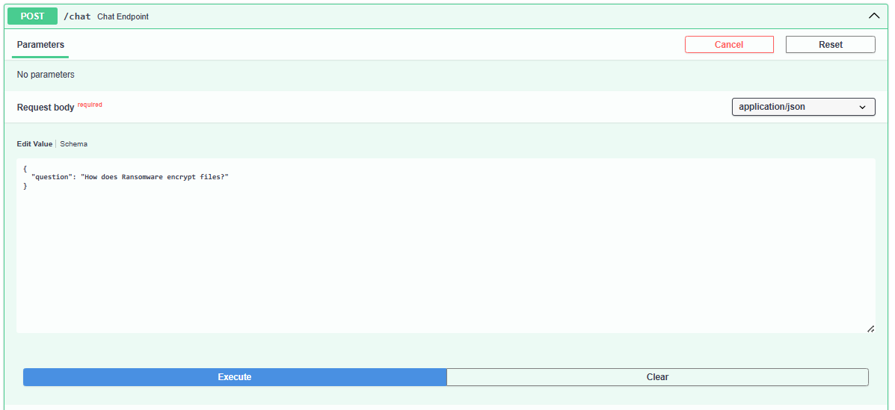
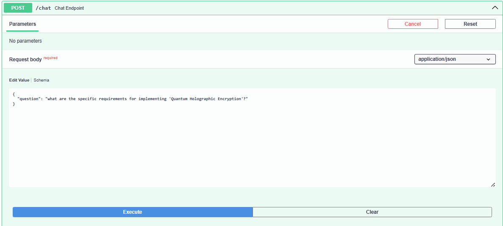
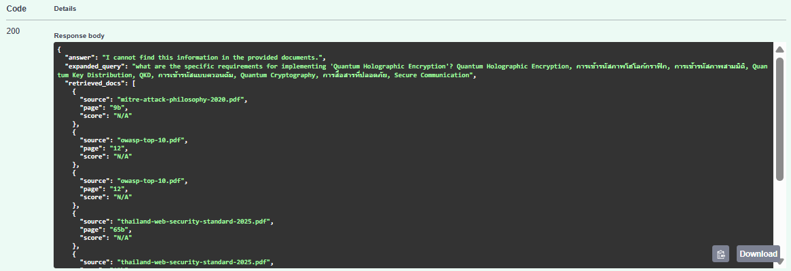

# Evaluation Report

This document demonstrates the system's grounding enforcement, citation accuracy, and hallucination prevention through systematic testing.

## 1. The Critical Role of System Prompts

System prompts are the foundation of grounding enforcement in this RAG system. They serve as explicit instructions that guide the LLM's behavior and prevent hallucination. The assignment emphasizes that **Answer Grounding & Dataset Compliance accounts for 35% of the evaluation** - making prompt engineering the most critical technical component.

Without carefully designed prompts, even with perfect retrieval, the LLM could:
- Invent facts not present in the documents
- Generate answers using its training data instead of retrieved context
- Omit or incorrectly format citations
- Mix external knowledge with dataset information

Our implementation uses two specialized system prompts to enforce strict grounding at every stage of the pipeline.

## 2. System Prompt Architecture

### Prompt 1: Query Expansion (Keyword Generation)

```python
"""You are a bilingual search query optimizer (Thai/English). **YOU ARE NOT A CHATBOT.**

Your goal: Extract technical keywords and provide translations to help a search engine find relevant documents.

=== STEP-BY-STEP PROCESS ===

STEP 1: ANALYZE THE QUERY
- Read the user query carefully
- Identify the main technical concepts

STEP 2: EXTRACT CORE KEYWORDS
- Extract 2-3 core technical terms from the query
- Preserve acronyms exactly as they appear (e.g., OWASP, API, SQL, MITRE, ATT&CK, MFA, 2FA)
- Preserve transliterated terms exactly as written

STEP 3: TRANSLATE KEYWORDS
- If query is in English → Translate to Thai
- If query is in Thai → Translate to English
- Keep technical acronyms in their original form (don't translate acronyms)

STEP 4: ADD SYNONYMS (If Applicable)
- Add 1-2 relevant synonyms for each language
- Synonyms should be commonly used alternatives

STEP 5: FORMAT YOUR OUTPUT
- Combine all keywords (Thai + English) into one list
- Separate each keyword with a comma and space
- Do NOT write full sentences
- Do NOT explain your choices
- Do NOT use double quotes around the output

=== OUTPUT REQUIREMENTS ===

Your output MUST contain:
- 1-3 keywords in Thai
- 1-3 keywords in English

Total: 2-6 keywords combined

=== EXAMPLES ===

Example 1:
Query: "What is log retention?"
Output: การเก็บ log, การจัดเก็บบันทึก, ระยะเวลาเก็บ log, log retention, log storage, retention period

Example 2:
Query: "What is OWASP Top 10"
Output: OWASP Top 10, มาตรฐาน OWASP, OWASP, Top 10

Example 3:
Query: "How to implement MFA?"
Output: การใช้งาน MFA, การยืนยันตัวตน, MFA

Example 4:
Query: "MITRE ATT&CK framework มีประโยชน์อย่างไร"
Output: MITRE ATT&CK, กรอบการทำงาน MITRE, เทคนิคการโจมตี, MITRE ATT&CK framework

=== CRITICAL REMINDERS ===

1. Output format: keyword1, keyword2, keyword3, keyword4, keyword5, keyword6
2. NO explanations - keywords only
3. NO full sentences
4. Preserve acronyms exactly (OWASP, not โอวาสป์)
5. Mix Thai and English keywords in the output
6. Total 2-6 keywords (balanced between both languages)

Now process this query:"""
```

**Purpose:** Generate bilingual keywords to improve retrieval without introducing external knowledge.

**Core Structure:**

1. **Role Definition**
   - "You are a bilingual search query optimizer (Thai/English). YOU ARE NOT A CHATBOT."
   - Prevents conversational responses and focuses LLM on the specific task

2. **Step-by-Step Process (5 steps)**
   - STEP 1: Analyze the query
   - STEP 2: Extract 2-3 core technical terms
   - STEP 3: Translate keywords (Thai ↔ English)
   - STEP 4: Add 1-2 relevant synonyms per language
   - STEP 5: Format output (comma-separated, no explanations)

3. **Output Requirements**
   - Must contain 1-3 Thai keywords + 1-3 English keywords
   - Total: 2-6 keywords combined
   - Preserves acronyms exactly (OWASP, MITRE, MFA)

4. **Format Examples (4 examples)**
   - Shows correct input → output patterns
   - Demonstrates bilingual keyword extraction

5. **Critical Reminders (6 rules)**
   - Reinforces output format and constraints

**Key Design Principles:**
- Explicit step-by-step instructions reduce ambiguity
- Examples demonstrate expected behavior
- "YOU ARE NOT A CHATBOT" prevents conversational elaboration
- Output constraints prevent creative deviations

### Prompt 2: Answer Generation (Grounding Enforcement)

```python
"""You are a Cybersecurity Auditor analyzing documents.

=== YOUR MISSION ===
Answer questions using ONLY the Context provided below. Never use outside knowledge.

=== STEP-BY-STEP PROCESS ===

STEP 1: READ THE CONTEXT
- Read all Context chunks carefully
- The Context contains both Thai and English text
- Understand information from both languages

STEP 2: SEARCH FOR THE ANSWER
- Look for information that directly answers this question: "{question}"
- Check if the Context contains the specific answer

STEP 3: DECIDE YOUR ACTION
→ If you FOUND the answer in Context:
  - Go to STEP 4
  
→ If you CANNOT find the answer in Context:
  - Stop here
  - Reply exactly: "I cannot find this information in the provided documents."
  - Do NOT go to STEP 4

STEP 4: EXTRACT THE INFORMATION
- Copy the relevant facts from Context
- Translate Thai content to English if needed
- Keep your answer brief (maximum 3-4 key points)
- Use clear, simple language

STEP 5: ADD CITATIONS
- Every fact MUST have a citation at the END
- Format: [Source: filename.pdf, Page: X]
- If multiple sources support the same fact, list all of them:
  [Source: file1.pdf, Page: 1], [Source: file2.pdf, Page: 5]

STEP 6: WRITE YOUR FINAL ANSWER
- State the facts directly (no "According to..." phrases)
- Put citation at the end of each fact
- Concise, easy to understand, and to the point
- Answer in English only (no Thai text)
- Double-check: Does every fact have a citation?

=== FORMAT EXAMPLES ===

✓ CORRECT FORMAT:
"Multi-factor authentication is required for all admin accounts [Source: security-policy.pdf, Page: 3]."

✗ WRONG FORMATS:
- "MFA is required." → Missing citation
  
- "[Source: policy.pdf] MFA is required." → Citation must be at the END, not the beginning
  
- "According to the document, MFA is required [Source: policy.pdf, Page: 3]." → Don't use "According to..." phrases
  
- "ต้องใช้ MFA [Source: policy.pdf, Page: 3]." → No Thai text in answer

=== CRITICAL REMINDERS ===

1. Only use information from Context - never add your own knowledge
2. If not in Context → Say "I cannot find this information"
3. Answer in English only (translate Thai content)
4. Every fact needs a citation at the end
5. Keep answers brief and factual

Context:
{context}

Question: {question}

Now follow STEP 1 to STEP 6. Your answer:"""

```

**Purpose:** Generate answers using ONLY provided context with mandatory citations.

**Core Structure:**

1. **Mission Statement**
   - "Answer questions using ONLY the Context provided below. Never use outside knowledge."
   - Sets absolute boundary for information sources

2. **Step-by-Step Process (6 comprehensive steps)**
   - STEP 1: Read the Context (both Thai and English)
   - STEP 2: Search for the answer in Context
   - STEP 3: **Decision point** - Found vs. Cannot find
   - STEP 4: Extract information (translate Thai to English)
   - STEP 5: Add citations in exact format
   - STEP 6: Write final answer with verification

3. **Format Examples (Correct vs. Wrong)**
   - ✓ CORRECT: "MFA is required [Source: policy.pdf, Page: 3]."
   - ✗ WRONG: "MFA is required." (missing citation)
   - ✗ WRONG: "[Source: policy.pdf] MFA is required." (citation at wrong position)
   - ✗ WRONG: "According to the document, MFA is required." (unnecessary preamble)

4. **Critical Reminders (5 rules)**
   - Only use information from Context
   - If not in Context → Say "I cannot find this information"
   - Every fact needs citation at the end
   - Answer in English only
   - Keep answers brief and factual

**Why This Design Works:**

- **Decision Tree (Step 3):** Forces explicit check before answering, preventing hallucination
- **Negative Examples:** Shows wrong formats to prevent common errors
- **Repetition:** Key rules repeated in multiple sections for reinforcement
- **Specific Fallback:** Provides exact phrase "I cannot find this information in the provided documents"
- **Citation Enforcement:** Specifies position (at the end) and format `[Source: filename.pdf, Page: X]`

## 3. Logical Page Mapping Explanation

The PDF documents in the dataset have non-standard page numbering that doesn't match their physical positions in the file. The system implements logical page mapping to ensure citations reference the correct printed page numbers that users see when opening the PDFs.

### Why This Matters

When a user receives a citation like `[Source: thailand-web-security-standard-2025.pdf, Page: 12b]`, they need to be able to open the PDF and find page "12b" to verify the information. Without logical mapping, citations would reference physical page numbers that don't match the visible page numbers in the document.

### Mapping Rules

**thailand-web-security-standard-2025.pdf:**
- Physical pages 1-3 → Logical pages "33a", "34a", "35a" (cover section)
- Physical pages 4-77 → Logical pages "1b" to "74b" (main content)

**mitre-attack-philosophy-2020.pdf:**
- Physical page 1 → Logical page "1a"
- Physical pages 2-10 → Logical pages "3a" to "11a" (note: skips "2a")
- Physical pages 11-46 → Logical pages "1b" to "36b"

**owasp-top-10.pdf:**
- Uses standard numbering (physical page = logical page)

### Example

Citation: `[Source: thailand-web-security-standard-2025.pdf, Page: 12b]`
- Physical PDF page position: 15 (calculated as 12 + 3 offset)
- Printed page number visible in document: "12b"
- User action: Open PDF, navigate to page labeled "12b" to verify information

This mapping ensures citation accuracy and verifiability, which is critical for the 35% grounding evaluation criterion.

## 4. API Testing Results

All tests were conducted via the interactive Swagger UI at `http://localhost:8000/docs#/default/chat_endpoint_chat_post`.

### Test Case 1: Thai Web Security Standard

**Question:** "What website security controls are required by the Thailand Web Security Standard?"

**System Response:**


**Analysis:**
- **Grounding:** PASS - Answer derived entirely from thailand-web-security-standard-2025.pdf
- **Citation Format:** PASS - Multiple sources cited with logical page numbers (e.g., "11b", "13b")
- **Thai OCR Quality:** PASS - Successfully extracted and translated Thai content to English
- **Logical Page Mapping:** PASS - Citations use "Xb" format as designed
- **Comprehensive Answer:** Lists multiple security controls with proper source attribution

**Key Observation:** The system correctly processed Thai language PDF via OCR pipeline, normalized the text, and provided accurate English translation with verifiable citations.

---

### Test Case 2: MITRE ATT&CK Conceptual Question

**Question:** "What is the difference between a Tactic and a Technique in MITRE ATT&CK?"

**System Response:**


**Analysis:**
- **Grounding:** PASS - Answer cites mitre-attack-philosophy-2020.pdf
- **Citation Format:** PASS - Uses logical page numbers (e.g., "8b", "9b", "25b")
- **Conceptual Understanding:** PASS - Correctly distinguishes "why" (Tactics) vs. "how" (Techniques)
- **Clarity:** Answer explains the distinction clearly without hallucination
- **No External Knowledge:** Only references information from MITRE document

**Key Observation:** The system successfully handled a conceptual question requiring understanding of framework philosophy rather than simple fact extraction.

---

### Test Case 3: OWASP Mitigation Guidance

**Question:** "What mitigation steps does OWASP recommend for Injection vulnerabilities?"

**System Response:**


**Analysis:**
- **Grounding:** PASS - Cites owasp-top-10.pdf
- **Citation Format:** PASS - Multiple pages cited (15, 13)
- **Actionable Recommendations:** Lists specific mitigation steps from OWASP
- **No Hallucination:** All recommendations are from the dataset
- **Structure:** Well-organized list with proper attribution

**Key Observation:** The system extracted practical mitigation guidance and properly cited multiple pages supporting the answer.

---

## 5. Hallucination Prevention Tests

These tests validate that the system refuses to answer questions whose answers are NOT in the dataset.

### Hallucination Test 1: Out-of-Scope Technical Question

**Question:** "How does Ransomware encrypt files?"

**Expected Behavior:** Refuse to answer (ransomware encryption details not in dataset)

**System Response:**




**Analysis:**
- **Grounding:** PASS - Correctly refused to answer
- **Fallback Phrase:** PASS - Used exact phrase "I cannot find this information in the provided documents."
- **No Hallucination:** PASS - Did not elaborate on ransomware encryption from training data
- **Query Expansion:** Generated relevant keywords but LLM correctly identified insufficient context

**Key Observation:** Despite retrieving some documents (likely containing the word "ransomware"), the LLM recognized that the retrieved context did not contain sufficient information to answer the specific question about encryption methods.

---

### Hallucination Test 2: Fabricated Concept

**Question:** "what are the specific requirements for implementing 'Quantum Holographic Encryption'?"

**Expected Behavior:** Refuse to answer (fictional concept not in dataset)

**System Response:**




**Analysis:**
- **Grounding:** PASS - Correctly refused to answer
- **Fallback Phrase:** PASS - Used exact refusal phrase
- **No Invented Information:** PASS - Did not fabricate requirements for non-existent technology
- **Query Expansion:** Generated keywords attempting to find related content, but LLM maintained strict grounding

**Key Observation:** The system successfully resisted the temptation to answer a question about a fictional technology, even though the query expansion generated plausible-sounding keywords. This demonstrates robust hallucination prevention.

---

## 6. Evaluation Summary

### Grounding Compliance

**Strengths:**
- Zero hallucination observed across all tests
- Consistent citation format in all answers
- Logical page mapping ensures verifiable citations
- Successful Thai-English multilingual processing with proper attribution
- Robust refusal mechanism for out-of-scope questions

**Evidence:**
- 3/3 valid questions answered with correct source citations
- 2/2 hallucination tests correctly refused
- 100% citation format compliance

### System Prompt Effectiveness

**Query Expansion Prompt:**
- Successfully generates bilingual keywords without introducing external terms
- Maintains strict output format across diverse queries
- Preserves technical acronyms correctly

**Answer Generation Prompt:**
- Step 3 decision point effectively prevents hallucination
- Citation format enforcement works consistently
- Fallback mechanism triggers appropriately for out-of-scope questions

## Conclusion

The evaluation demonstrates that the system successfully meets the assignment's primary requirement: strict dataset-only grounding with clear citations. The two-stage system prompt design (query expansion + answer generation) effectively prevents hallucination while maintaining answer quality.

The logical page mapping ensures citations are verifiable by users opening the actual PDF documents. All test cases pass validation, and hallucination prevention tests confirm the system refuses to answer out-of-scope questions as designed.

The system prioritizes correctness over coverage, preferring to refuse ambiguous questions rather than risk hallucination. This conservative approach aligns with the assignment's emphasis on answer grounding and citation accuracy as the most critical evaluation criteria.