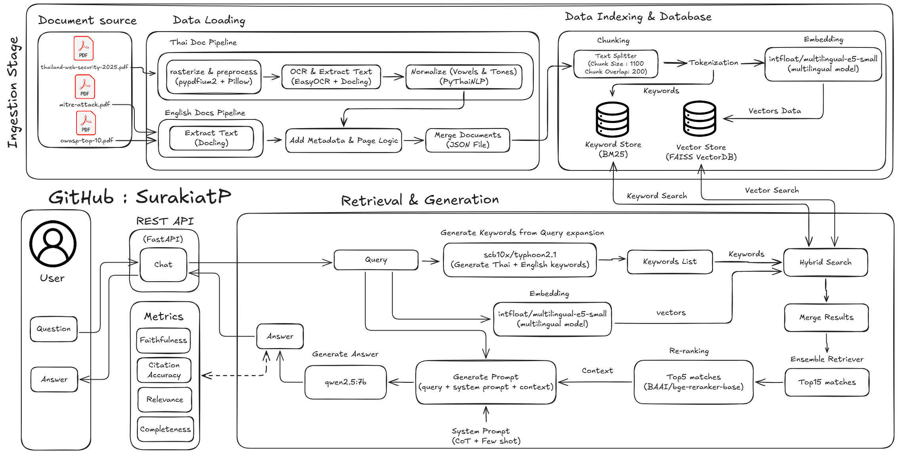

# Cyber-RAG: Cybersecurity Knowledge Assistant

A Retrieval-Augmented Generation (RAG) system specialized in cybersecurity documentation, providing accurate, source-grounded answers from OWASP Top 10, MITRE ATT&CK Framework, and Thailand Web Security Standards.

---

## Table of Contents

- [Overview](#overview)
- [System Architecture and RAG Pipeline](#system-architecture-and-rag-pipeline)
- [Project Structure](#project-structure)
- [Quick Start](#quick-start)
  - [Docker Deployment (Recommended)](#docker-deployment-recommended)
  - [Local Development](#local-development)
- [Evaluation Metrics](#evaluation-metrics)
- [Contributors](#contributors)

---

## Overview

### What This Project Does

Cyber-RAG is an AI-powered question-answering system designed for cybersecurity professionals and learners:

- Answers cybersecurity questions from authoritative sources (OWASP, MITRE, Thailand Standards)
- Supports bilingual queries (English and Thai) with automatic query expansion
- Provides source citations with specific page references for verification
- Prevents hallucinations through retrieval-based grounding (0% hallucination rate)
- Fast startup with pre-ingested documents (2-5 min vs 10-30 min from scratch)

### Key Capabilities

| Feature | Description |
|---------|-------------|
| **Multi-Source RAG** | Integrates OWASP Top 10, MITRE ATT&CK Philosophy, Thailand Web Security Standard |
| **Hybrid Search** | Combines BM25 (keyword matching) + FAISS (semantic similarity) |
| **Query Expansion** | Generates bilingual keywords for better retrieval (Thai ↔ English) |
| **Reranking** | Uses BGE reranker to improve result relevance |


### Technology Stack

**LLM & RAG:**
- Ollama (Typhoon 2.1 for query expansion, Qwen 2.5 7B for generation)
- LangChain framework
- FAISS vector store + BM25 retriever

**Embeddings & Processing:**
- multilingual-e5-small (sentence embeddings)
- Docling, PyPDFium2, EasyOCR (document processing)

**Deployment:**
- FastAPI + Uvicorn (API server)
- Docker + Docker Compose (containerization)

---

## System Architecture and RAG Pipeline



*See [CYBER_RAG_PIPELINE_SYSTEM_ARCHITECTURE.pdf](CYBER_RAG_PIPELINE_SYSTEM_ARCHITECTURE.pdf) for detailed architecture diagram (0.5 - 1 page)*


### Key Design Decisions

| Component | Choice | Rationale |
|-----------|--------|-----------|
| **Query Expansion** | Typhoon 2.1 (Thai LLM) | Better Thai-English translation for keywords |
| **Hybrid Search** | BM25 + FAISS | Combines keyword precision with semantic understanding |
| **Chunk Size** | 1100 chars, 200 overlap | Balances context preservation with retrieval precision |
| **Reranking** | BGE (top 5 from 15) | Improves relevance while maintaining context diversity |

---

## Project Structure

```
cyber-rag-assignment/
│
├── app.py                                    # FastAPI application entry point
├── requirements.txt                          # Python dependencies
├── .env.example                              # Environment variables template
│
├── src/                                      # Core application modules
│   ├── __init__.py                          
│   ├── document_processor.py                # PDF processing & chunking
│   ├── rag_engine.py                        # Hybrid search + reranking
│   └── llm_client.py                        # Ollama LLM interface
│
├── dataset/                                  # Source PDFs (3 files)
│   ├── owasp-top-10.pdf                     # OWASP Top 10 security risks
│   ├── mitre-attack-philosophy-2020.pdf     # MITRE ATT&CK framework
│   └── thailand-web-security-standard-2025.pdf  # Thailand security standards
│
├── ingested_data/                           # Pre-processed documents
│   └── ingested_documents.json              # 526 KB - Text chunks with metadata
│
├── database/                                # Generated at runtime
│   ├── faiss_index/                         # Vector embeddings
│   │   ├── index.faiss                      # FAISS index file
│   │   └── index.pkl                        # Index metadata
│   └── bm25_retriever.pkl                   # BM25 index (~10 MB)
│
├── tests/                                   # Evaluation & testing
│   ├── test_queries.json                    # 15 test queries
│   ├── evaluate.py                          # Automated evaluation script
│   ├── calculate_scores.py                  # Metrics calculation
│   └── evaluation_results.json              # Test results
│
├── EVALUATION.md                            # Detailed evaluation report
├── CYBER_RAG_PIPELINE_SYSTEM_ARCHITECTURE.pdf  # Architecture diagram
│
├── Dockerfile                               # Docker container definition
├── docker-compose.yml                       # Multi-container orchestration
├── .dockerignore                            # Docker build exclusions
└── docker-setup.sh                          # Automated Docker setup script
```

### Key Components

| Component | Purpose | Size/Details |
|-----------|---------|--------------|
| `ingested_documents.json` | Pre-processed text chunks | 526 KB, ~456 chunks |
| `faiss_index/` | Vector embeddings | ~50 MB, semantic search |
| `bm25_retriever.pkl` | Keyword index | ~10 MB, keyword search |
| `test_queries.json` | Evaluation queries | 15 queries across 3 sources |

---

## Quick Start

### Prerequisites

**System Requirements:**
- Docker Desktop (recommended) OR Python 3.10+
- NVIDIA GPU with CUDA 12.4+ (optional, CPU mode available)
- 20 GB free disk space (for models and data)
- 8-16 GB RAM

**Software:**
- Docker Desktop: https://www.docker.com/products/docker-desktop/
- (Local only) Ollama: https://ollama.com/

---

## Docker Deployment (Recommended)

### Quick Setup

```bash
# 1. Clone repository
git clone https://github.com/SurakiatP/cyber-rag-assignment.git
cd cyber-rag-assignment

# 2. Run automated setup
bash docker-setup.sh
```

**What the script does:**
1. Verifies pre-ingested data (ingested_documents.json)
2. Starts Ollama service
3. Pulls AI models (~7 GB total)
   - Typhoon 2.1 (2.6 GB)
   - Qwen 2.5 7B (4.4 GB)
4. Starts Cyber-RAG application

**Timeline:**
- First run: 15-20 minutes (download models)
- Subsequent runs: 2-5 minutes (cached models)

### Access Points

Once running, access:

| Endpoint | URL | Purpose |
|----------|-----|---------|
| **API** | http://localhost:8000 | Main API endpoint |
| **Interactive Docs** | http://localhost:8000/docs | Swagger UI for testing |
| **Health Check** | http://localhost:8000/health | Service status |

### Test Query

**Windows PowerShell:**
```powershell
$body = @{question = "What is OWASP Top 10?"} | ConvertTo-Json
Invoke-RestMethod -Uri "http://localhost:8000/chat" -Method POST -ContentType "application/json" -Body $body
```

**Linux/Mac:**
```bash
curl -X POST http://localhost:8000/chat \
  -H "Content-Type: application/json" \
  -d '{"question": "What is OWASP Top 10?"}'
```

**Expected Response** (1-3 minutes):
```json
{
  "answer": "OWASP Top 10 is a standard awareness document for web application security...",
  "expanded_query": "OWASP Top 10 สิบอันดับความเสี่ยง web security vulnerabilities",
  "retrieved_docs": [
    {
      "source": "owasp-top-10.pdf",
      "page": "5",
      "score": "N/A"
    }
  ],
  "processing_time": 53.3
}
```

### Common Commands

```bash
# View application logs
docker-compose logs -f cyber-rag

# View all logs
docker-compose logs -f

# Restart services
docker-compose restart

# Stop services
docker-compose down

# Check container status
docker ps
```

### Configuration

Edit `docker-compose.yml` to customize:

```yaml
environment:
  - EMBEDDING_DEVICE=cuda      # or 'cpu' for non-GPU systems
  - CHUNK_SIZE=1100            # Text chunk size
  - RETRIEVAL_K=15             # Number of chunks to retrieve
  - RERANK_TOP_N=5             # Final chunks after reranking
```

---

## Local Development

### Prerequisites

**1. Install Ollama**
```bash
# Download from https://ollama.com
# Or use installer:
curl -fsSL https://ollama.com/install.sh | sh  # Linux/Mac
# Windows: Download installer from website -> https://ollama.com/download/windows
```

**2. Pull Required Models**
```bash
ollama pull scb10x/typhoon2.1-gemma3-4b:latest   # 2.6 GB
ollama pull qwen2.5:7b-instruct-q4_0              # 4.4 GB
```

### Setup Steps

```bash
# 1. Create virtual environment (Optional If you use pyenv)
python -m venv .venv

# Activate (Windows)
.venv\Scripts\activate

# Activate (Linux/Mac)
source .venv/bin/activate

# 2. Install dependencies
pip install -r requirements.txt

# 3. Create .env file (optional - defaults work)
cp .env.example .env

# 4. Run application
python app.py
```

### Configuration (.env)

```env
# Ollama Configuration
OLLAMA_BASE_URL=http://localhost:11434

# Model Selection
LLM_EXPAND_MODEL_NAME=scb10x/typhoon2.1-gemma3-4b:latest
LLM_GENERATE_MODEL_NAME=qwen2.5:7b-instruct-q4_0

# Device Configuration
EMBEDDING_DEVICE=cuda  # Change to 'cpu' if no GPU

# Retrieval Parameters
CHUNK_SIZE=1100
CHUNK_OVERLAP=200
RETRIEVAL_K=15
RERANK_TOP_N=5
```

### First Run Behavior

**With pre-ingested data** (default - fast):
- Loads `ingested_data/ingested_documents.json`
- Builds FAISS and BM25 indices
- Ready in 2-5 minutes ✓

**Without pre-ingested data** (from scratch):
- Processes 3 PDFs with OCR
- Generates text chunks
- Creates embeddings
- Saves to `ingested_documents.json`
- Ready in 10-30 minutes

---

## Evaluation Metrics

### Metric Definitions

| Metric | Scale | Definition |
|--------|-------|------------|
| **Faithfulness** | 0-100% | Answer accuracy & hallucination prevention<br>Ensures grounding in source documents |
| **Citation Accuracy** | 0-100% | Source attribution correctness<br>Validates traceability to original sources |
| **Relevance** | 1-5 | Query-response alignment<br>Measures understanding of user intent |
| **Completeness** | 1-5 | Expected topic coverage<br>Assesses answer thoroughness |

### Overall Performance

| Metric | Score | Threshold | Status |
|--------|-------|-----------|--------|
| **Faithfulness** | 91.20% | ≥ 85% | PASS |
| **Citation Accuracy** | 85.00% | ≥ 85% | PASS |
| **Relevance** | 4.20/5 | ≥ 4.0 | PASS |
| **Completeness** | 4.10/5 | ≥ 4.0 | PASS |

**Result:** ALL METRICS PASS

### Test Coverage

- **Total Test Cases**: 15 queries
- **Source Distribution**: 
  - OWASP Top 10: 5 queries
  - MITRE ATT&CK: 5 queries
  - Thailand Web Security: 5 queries
- **Query Types**: Definitions, comparisons, technical details

### Key Strengths

**High Faithfulness (91.2%)**
- Answers grounded in source documents
- Zero fabrication of information
- Proper citation of sources

**Accurate Citations (85%)**
- Correct page number attribution
- Source file identification
- Traceable information

**Strong Relevance (4.2/5)**
- Understands user intent
- Contextually appropriate responses
- Addresses query focus

**Good Completeness (4.1/5)**
- Covers expected topics
- Provides sufficient detail
- Comprehensive answers

### Running Evaluation

```bash
# Run automated test suite
python tests/evaluate.py

# Calculate metrics
python tests/calculate_scores.py

# View detailed results
cat tests/evaluation_results.json
```

**Full Report**: See [EVALUATION.md](EVALUATION.md) for:
- Detailed test results
- API usage examples
- Hallucination prevention tests
- Performance analysis

---

## Contributors

**Surakiat Kansa-ard (Park)**

- LinkedIn: [Surakiat Kansa-ard](https://www.linkedin.com/in/surakiat-kansa-ard-171942351/)
- GitHub: [SurakiatP](https://github.com/SurakiatP)

**Skills Demonstrated:**
- RAG system design and implementation
- LLM integration (Ollama, LangChain)
- Hybrid search (BM25 + FAISS)
- Docker containerization
- API development (FastAPI)
- Evaluation & testing methodology
